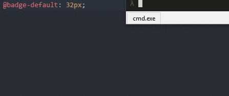
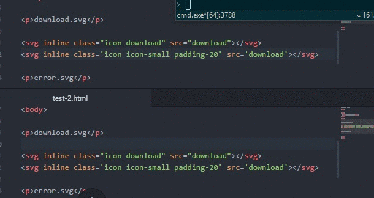

<p align="center">
  
</p>

# FrontBox Grunt

Strongly integrated with:

> https://github.com/BartoszPiwek/FrontBox-Grunt

Bunch of useful grunt tasks for Front-End Developer
```
Author: Bartosz Piwek
Last version: 1.0.6
```

## Getting Started
This plugin requires Grunt `~0.4.5`

If you haven't used [Grunt](http://gruntjs.com/) before, be sure to check out the [Getting Started](http://gruntjs.com/getting-started) guide, as it explains how to create a [Gruntfile](http://gruntjs.com/sample-gruntfile) as well as install and use Grunt plugins. Once you're familiar with that process, you may install this plugin with this command:

```shell
npm install frontbox-grunt --save-dev
```

## Required for multitasks
In module export function (in Gruntfile.js) must be require declaration
```js
module.exports = function(grunt) {
// other
require('jit-grunt')(grunt, {
  autocolor: 'node_modules/frontbox-grunt/tasks/autocolor.js',
  autoclass: 'node_modules/frontbox-grunt/tasks/autoclass.js',
  autosvg: 'node_modules/frontbox-grunt/tasks/autosvg.js',
});
// other
grunt.initConfig({
// other
```

## Task: autocolor

Scan CSS Preprocessor files (LESS/SASS) and automatically replace/create variable for colors.

```js
    autocolor: {
      automatic: {
        expand: true,
        src: '**',
        cwd: 'less/',
        filter: 'isFile'
      },
      options: {
        variableFile: "less/variables/_colors.less",
        prefix: "@",
      }
    },
```

```js
    grunt.registerTask('color', ['autocolor']);
```

### Options

#### options.variableFile
Type: `String`

Path for less/sass file contain all colors variables

#### options.prefix
Type: `String`

CSS Preprocessors variable prefix.
```less
  @variable: 16px;
```
```sass
  $variable: 16px;
```

### Preview
<p align="center">
  
</p>

## Task: autosvg

Automatically insert SVG tag with class and inline path

```js
  autosvg: {
    automatic: {
      expand: true,
      src: ['*.html', "*.php"],
      cwd: 'template/',
      flatten: true,
    },
    options: {
      output_directory: "public/",
      svg_directory: "svg/",
      debug_log: true,
    }
  },
```

```js
    grunt.registerTask('svg', ['autosvg']);
```

### Usage

Place SVG tag with 'inline' string in the begin and src with SVG filename (without .svg and path):

```html
  <svg inline class="icon download" src="download"></svg>
```

### Options

#### options.output_directory
Type: `String`

Path directory for output files.

#### options.svg_directory
Type: `String`

Path for svg directory files.

#### options.debug_log
Type: `Bool` Default value: 'false'

Print expanded log.

### Preview
<p align="center">
  
</p>

## Task: autometa

Automatic insert meta tags

```js
    autometa: {
      automatic: {
        expand: true,
        src: ['*.html'],
        cwd: 'test/plugin-twitter',
        flatten: true,
      },
      options: {
        debug: true,
        twitter_account: "@twitter-account",
        website_name: "Website name",
        website_url: "http://example.com",
        image_dir: "images",
        image_format: "jpg",
        website_locale: "pl_PL",
        rename_url: {
          "index.html": "index2.html"
        },
        website_dir: "test/plugin-twitter/"
      }
    },
```

```js
    grunt.registerTask('meta', ['autometa']);
```

### Usage
Only fill task options

### Options
TODO


## Bugs and development
>
- Feel free
> https://github.com/BartoszPiwek/FrontBox-Grunt/issues

## Release History

_1.0.61 - add autometa_
<br>
_1.0.6 - autosvg: easy class insert; change tag_
<br>
_1.0.5 - autoclass: repair duplication; cleaning_
<br>
_1.0.41 - add autosvg (no publish)_
<br>
_1.0.4 - autocolor: fix match character size_
<br>
_1.0.3 - autocolor: fix ignore variableFile_
<br>
_1.0.2 - autocolor: convert variables name to uppercase letter; add filepath to variableFile_
<br>
_1.0.0 - add autocolor & autoclass_
